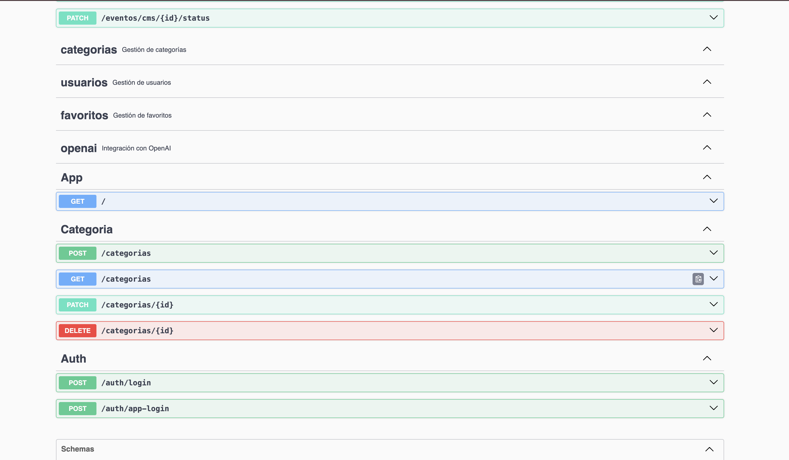
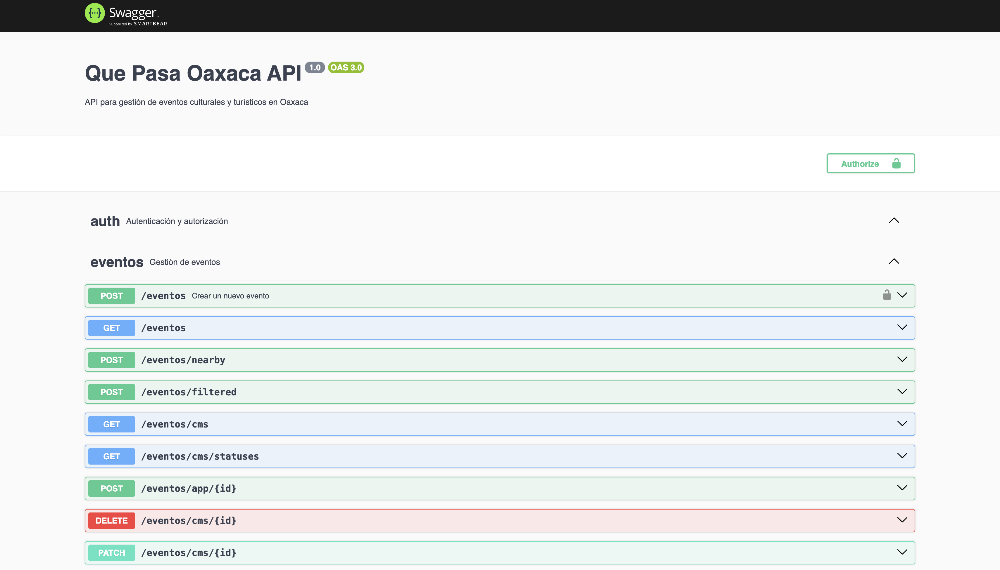

# 🎉 Que Pasa Oaxaca API

<div align="center">
  
  
  
</div>

## 📋 Descripción del Proyecto

**Que Pasa Oaxaca** es una API REST completa desarrollada en **NestJS** que gestiona eventos culturales y turísticos en Oaxaca, México. La aplicación permite a los usuarios descubrir, buscar y gestionar eventos locales con funcionalidades avanzadas de geolocalización y filtrado inteligente.

## 🚀 Características Principales

### 🎯 **Gestión de Eventos**
- ✅ Creación, edición y eliminación de eventos
- ✅ Descripciones cortas (350 chars) y largas (1700 chars)
- ✅ Geolocalización con coordenadas GPS
- ✅ Estados de eventos: draft, published, archived, expired
- ✅ Sistema de categorización flexible

### 🔍 **Búsqueda Inteligente**
- ✅ **Búsqueda por proximidad** con filtros de radio
- ✅ **Filtrado por fecha** (hoy, semana, mes)
- ✅ **Búsqueda por categorías** y palabras clave
- ✅ **Ordenamiento** por relevancia, proximidad o fecha
- ✅ **Paginación** inteligente

### 🗺️ **Geolocalización Avanzada**
- ✅ **Cálculo de distancias** usando PostGIS
- ✅ **Búsquedas por radio** (5km, 20km, 50km)
- ✅ **Filtrado por proximidad** con coordenadas opcionales
- ✅ **Optimización espacial** para consultas rápidas

### 🔐 **Sistema de Autenticación**
- ✅ **JWT** para autenticación segura
- ✅ **Roles diferenciados**: admin, app_user, app_user_logged
- ✅ **Guards personalizados** para control de acceso
- ✅ **Validación robusta** con class-validator

### 📱 **Funcionalidades de Usuario**
- ✅ **Sistema de favoritos** por usuario y dispositivo
- ✅ **Perfiles de usuario** con roles
- ✅ **Gestión de categorías** personalizadas

## 🛠️ Stack Tecnológico

### **Backend Framework**
- **NestJS** - Framework Node.js progresivo
- **TypeScript** - Tipado estático para mayor robustez
- **TypeORM** - ORM para PostgreSQL

### **Base de Datos**
- **PostgreSQL** - Base de datos principal
- **PostGIS** - Extensiones geoespaciales
- **Migrations** - Control de versiones de esquema

### **Autenticación & Seguridad**
- **JWT** - JSON Web Tokens
- **Passport.js** - Estrategias de autenticación
- **bcryptjs** - Hashing de contraseñas
- **class-validator** - Validación de datos

### **Documentación & Testing**
- **Swagger/OpenAPI** - Documentación interactiva
- **Jest** - Framework de testing
- **ESLint + Prettier** - Linting y formateo

### **Integraciones**
- **OpenAI API** - Funcionalidades de IA
- **CORS** - Configuración para frontend

## 📊 Arquitectura del Proyecto

```
src/
├── auth/           # Autenticación y autorización
├── evento/         # Gestión de eventos
├── categoria/      # Categorías de eventos
├── user/           # Gestión de usuarios
├── favorite/       # Sistema de favoritos
├── openai/         # Integración con IA
└── migrations/     # Migraciones de base de datos
```

## 🔧 Endpoints Principales

### **Eventos**
- `POST /eventos` - Crear evento
- `GET /eventos` - Listar eventos
- `POST /eventos/nearby` - Búsqueda por proximidad
- `POST /eventos/filtered` - Filtrado avanzado
- `POST /eventos/:id` - Obtener evento específico

### **Autenticación**
- `POST /auth/login` - Iniciar sesión
- `POST /auth/register` - Registrar usuario

### **Categorías**
- `GET /categorias` - Listar categorías
- `POST /categorias` - Crear categoría

## 🚀 Instalación y Configuración

### **Prerrequisitos**
- Node.js 18+
- PostgreSQL 12+
- PostGIS extension

### **Instalación**
```bash
# Clonar repositorio
git clone <repository-url>
cd que-pasa-oaxaca-api

# Instalar dependencias
npm install

# Configurar variables de entorno
cp config/env.example .env

# Ejecutar migraciones
npm run migration:run

# Iniciar en desarrollo
npm run start:dev
```

### **Variables de Entorno**
```env
# Database
DB_HOST=localhost
DB_PORT=5432
DB_USERNAME=postgres
DB_PASSWORD=password
DB_DATABASE=que_pasa_oaxaca

# JWT
JWT_SECRET=your-secret-key
JWT_EXPIRES_IN=7d

# OpenAI
OPENAI_API_KEY=your-openai-key
```

## 📚 Documentación

### **Swagger UI**
Accede a la documentación interactiva en:
```
http://localhost:3000/api/docs
```

### **API Documentation**
Ver documentación completa en: `API_DOCUMENTATION.md`

## 🧪 Testing

```bash
# Unit tests
npm run test

# E2E tests
npm run test:e2e

# Coverage
npm run test:cov
```

## 📈 Características Destacadas

### **Performance**
- ✅ **Consultas optimizadas** con TypeORM
- ✅ **Índices geoespaciales** en PostgreSQL
- ✅ **Paginación eficiente** para grandes datasets
- ✅ **Caching** de consultas frecuentes

### **Escalabilidad**
- ✅ **Arquitectura modular** con NestJS
- ✅ **Separación de responsabilidades**
- ✅ **Migrations** para cambios de esquema
- ✅ **Configuración por entorno**

### **Mantenibilidad**
- ✅ **TypeScript** para tipado estático
- ✅ **ESLint + Prettier** para consistencia
- ✅ **Documentación automática** con Swagger
- ✅ **Tests unitarios y E2E**

## 🎯 Casos de Uso

### **Para Usuarios Finales**
- Descubrir eventos cercanos a su ubicación
- Filtrar eventos por categoría, fecha o distancia
- Guardar eventos favoritos
- Obtener información detallada de eventos

### **Para Administradores**
- Crear y gestionar eventos
- Moderar contenido de eventos
- Analizar métricas de uso
- Gestionar categorías y usuarios

## 🤝 Contribución

1. Fork el proyecto
2. Crea una rama para tu feature (`git checkout -b feature/AmazingFeature`)
3. Commit tus cambios (`git commit -m 'Add some AmazingFeature'`)
4. Push a la rama (`git push origin feature/AmazingFeature`)
5. Abre un Pull Request

## 📄 Licencia

Este proyecto está bajo la Licencia MIT. Ver `LICENSE` para más detalles.

## 👨‍💻 Autor

**Isaias Chávez Martínez**
- LinkedIn: [Tu LinkedIn]
- GitHub: [Tu GitHub]
- Email: [Tu Email]

---

<div align="center">
  <p>Desarrollado con ❤️ para la comunidad de Oaxaca</p>
  <p>¡Descubre los eventos más increíbles de Oaxaca!</p>
</div>
